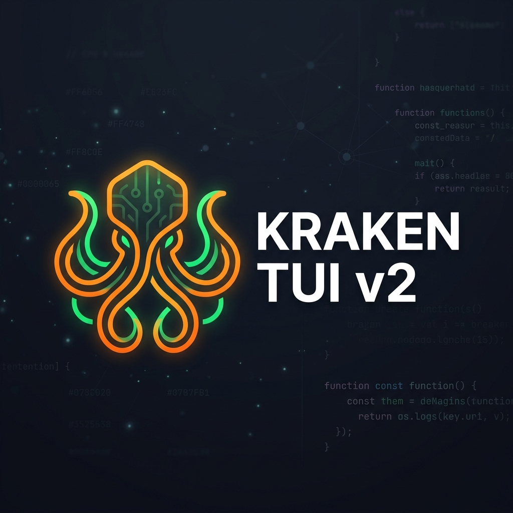

# 🐙 Kraken TUI v2



Kraken TUI v2 is an evolution of the original, focusing on customization, persistence, and a refined user experience.

## New in v2
- ⚙️ **Setup Menu**: Configure your experience without leaving the terminal.
- 🎨 **Theme Engine**: Support for multiple themes (Dracula, Ocean, Gruvbox) with Light/Dark modes.
- 💾 **Persistent Config**: All settings are saved automatically.
- ❓ **Help Overlay**: Instant access to keybindings.

## Integrated Panels
| Panel | Description |
|---|---|
| 🗂 **File Browser** | Navigate, create, rename, delete, copy/cut/paste, search, open files |
| 🤖 **Gemini AI Chat** | Multi-turn chat with Gemini 2.0 Flash, streaming responses, 3 persistent sessions |
| ✅ **Todo List** | Add, toggle, delete, and reorder tasks — persisted between runs |

---

## Prerequisites

- **Go 1.23+** — [https://go.dev/dl](https://go.dev/dl)
- **Gemini API Key** — [https://aistudio.google.com](https://aistudio.google.com) (free tier available)

---

## Quick Start

```bash
# 1. Clone the repo
git clone https://github.com/faran17/kraken_tui_v2.git
cd kraken_tui_v2

# 2. Set your Gemini API key
export GEMINI_API_KEY="your-api-key-here"

# 3. Build and run
make run
# or manually:
go mod tidy && go build -o kraken . && ./kraken
```

---

## Keybindings

### Global
| Key | Action |
|---|---|
| `Tab` | Cycle to next panel |
| `Shift+Tab` | Cycle to previous panel |
| `Shift/Alt/Ctrl + Arrows` | Resize active panel horizontally/vertically |
| `Ctrl+C` / `Ctrl+Q` | Quit |

### 🗂 File Browser
| Key | Action |
|---|---|
| `↑`/`↓` or `j`/`k` | Navigate |
| `Enter`/`→`/`l` | Open file or enter directory |
| `Backspace`/`←`/`h` | Go up one directory |
| `n` | New file |
| `N` (Shift+n) | New directory |
| `r` | Rename selected |
| `d` | Delete selected (with confirmation) |
| `y` | Copy (yank) |
| `x` | Cut |
| `p` | Paste |
| `o` | Open with system default app |
| `.` | Toggle hidden files |
| `/` | Search in current directory |
| `~` | Jump to home directory |

### 🤖 Gemini Chat
| Key | Action |
|---|---|
| `Enter` | Send message |
| `Ctrl+K` | Change API Key |
| `PgUp`/`PgDown` | Scroll chat history |
| `Alt+N` | Start new session |
| `Alt+←`/`Alt+→` | Switch between sessions |

> Chat history (last 3 sessions) is persisted to `~/.kraken/chat_history.json`

### ✅ Todo
| Key | Action |
|---|---|
| `↑`/`↓` or `j`/`k` | Navigate |
| `n` | Add new task |
| `Space` | Toggle done/undone |
| `d` / `x` | Delete task |
| `J` / `K` | Move task down/up |
| `g` / `G` | Jump to top/bottom |

> Todos are persisted to `~/.kraken/todos.json`

---

## Building for All Platforms

```bash
make cross
# Produces binaries in ./dist/:
#   kraken-darwin-arm64       (macOS Apple Silicon)
#   kraken-darwin-amd64       (macOS Intel)
#   kraken-linux-amd64
#   kraken-linux-arm64
#   kraken-windows-amd64.exe
```

Or manually:

```bash
# Linux
GOOS=linux GOARCH=amd64 go build -ldflags="-s -w" -o kraken-linux .

# Windows
GOOS=windows GOARCH=amd64 go build -ldflags="-s -w" -o kraken.exe .
```

---

## Configuration

| Item | Location |
|---|---|
| Main Config | `~/.kraken/v2_config.json` (Includes API Key, Theme, etc.) |
| Chat history | `~/.kraken/chat_history.json` |
| Todo list | `~/.kraken/todos.json` |
| Debug log | `./debug.log` (via `tea.LogToFile`) |

> [!TIP]
> You can now configure your API Key and Theme directly via the **Setup Menu** (`Ctrl+s` key) within the app.

---

## Project Structure

```
Kraken_TUI_v2/
├── main.go                    # Entry point
├── go.mod / go.sum
├── Makefile                   # Build + cross-compile targets
├── internal/
│   ├── app/app.go             # Root compositor model
│   ├── config/config.go       # Persistent settings manager
│   ├── setup/model.go         # Setup/Settings menu
│   ├── help/model.go          # Help overlay
│   ├── filebrowser/model.go   # File browser panel
│   ├── chat/model.go          # Gemini AI chat panel
│   └── todo/model.go          # Todo list panel
└── pkg/
    └── styles/styles.go       # Dynamic Theme Engine
```

---

## Tech Stack

- [Bubble Tea](https://github.com/charmbracelet/bubbletea) — TUI framework (Elm Architecture)
- [Bubbles](https://github.com/charmbracelet/bubbles) — UI components (textarea, viewport, spinner, textinput)
- [Lip Gloss](https://github.com/charmbracelet/lipgloss) — Layout & styling
- [Google Gen AI Go SDK](https://pkg.go.dev/google.golang.org/genai) — Gemini 2.0 Flash

---

## License

MIT
